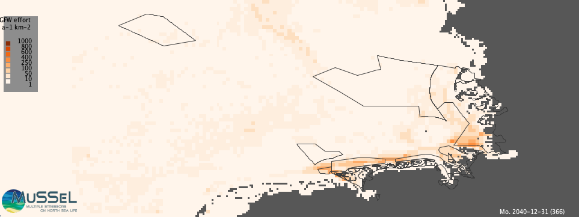
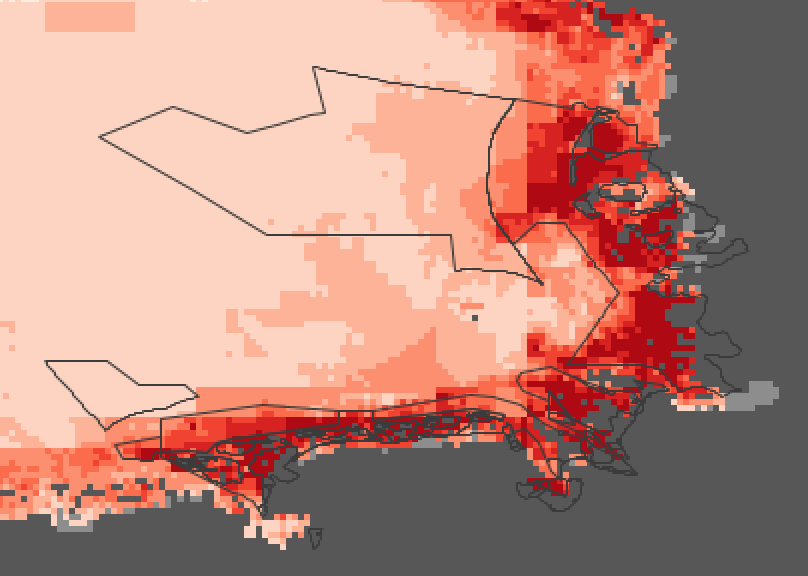

# Introduction

<!-- Cultural and economic value -->

The German North Sea shrimp fishery is a traditional sector of near-coastal fishery encompassing roughly 200 boats distributed in 20 ports along the German East Frisian and North Frisian coast. While mostly local, brown shrimp is economically the fourth most important European fishery with 169 M€ in 2018; of this 90% landed in Germany, the Netherlands and Denmark (WGCRAN 2022), <!-- NUMBERS for GERMAN, there is an EU workforce document --> employing roughly XXXX people directly, and sustaining the livelihood of XXXX communities along the coast. Processing and distribution of shrimp employs another XXX people and ultimatle yupports up to XXXX people .

<!-- WGCRAN 2022
The Brown Shrimp, Crangon crangon supports the fourth most valuable European fishery in the North Sea (EUR 169 million in 2018). The fishing fleets of Germany, the Netherlands and Denmark are responsible for over 90% of the yearly landings.-->

<!-- Characterization of shrimper -->

<!-- Goti Aralucea 2021:
In 2020, the German brown shrimp fishery constituted a total of 195
vessels, all have two beam trawls as gear, but they differ in their vessel
size, from 5 to 25 m (9.7% 0–12 m; 51% 12–18 m, 36% 18–24 m) and
crew size (1–3 persons). Ownership of the vessels is German or Dutch,
with most vessels probably being owner-operated, as there are only
eleven owners of 2 or 3 vessels. The management plan specifies the gear (Beam trawl with
bobbin/roller groundrope), mesh size (minimum 20 mm) and the
maximum beam length (10 m).The producer organisations
represented by the MSC label do not follow a quota plan or TAC management
but they occasionally agree on maximum weekly catches for all
vessels to distribute catch opportunities fairly between all members.
These maximum weekly catches are coordinated with the wholesalers
and normally applied when their maximum processing capacity is
reached, and therefore the amount of brown shrimp they can buy is
exhausted.

The current situation of the brown shrimp fishery was already
problematic before the outbreak of the pandemic, as they came from a
year of low revenues in 2019 and they were getting prepared to resume
the season in March, after the seasonal stop from December to February.
Therefore the current economic situation of the fishery is considered as
“at risk” [70].

-->

The shrimper vessels are typically small near-coastal vessels under 25 m in length with a gross weight of XXX tons, and holding capacity of XXX kg shrimp (find scaling REF). They are typically staffed by one up to three persons, and go on fishing trips between a few hours and a few days; the gears typically used by shrimper vessels is a light bottom trawling gear with bobbins, and deployed as a pair of beam trawls of maximum 10 m length (Goti-Aralucea). From the 20 ports of landing, the product is shipped to one of three processing plants, then sent overseas for peeling; small quantities are sold locally from the harbour unpeeled. Two large companies (monopsony), the Dutch Heiploeg and Klaas Puul controls the processing, shipping, and redistribution to the wholesale market. (op. cit)

<!-- Environmental impact -->

The shrimp fishery has long been under scrutiny from nature protection because of its disturbance effect on the sea floor. Though lighter than other bottom trawl nets, a full shrimp net will cause seafloor disturbance (Rijnsdorp 2020), estimated to be on the same order as weather (Prins et al. 2020), but likely more detrimental to long-lived species (Perez-Rodrigues 2019), possibly even favorable for short-lived ones (REF). No area of today’s North Sea can be claimed to be free of such disturbance, and much of the ocean floor is disturbed several times per year. This has been known for long, in fact, when the Wadden Sea heritage area was established in 1991, the shrimp fishers were granted an exception for their use.

In the North Sea, the German small-scale fishing fleet's biggest group are the shrimp beam trawlers. This small-scale fishing fleet is typically run by owner-operated family enterprises that uses boats smaller than 24 meters [@Döring2020]. These vessels' target species are mainly demersal (living near the bottom), and include plaice, sole, and brown shrimp [@Letschert2023].

All fisheries in the North Sea face area competition with other uses of the sea -- long practiced ones like shipping, gas exploration and sand extraction, and currently increasing ones like marine protection areas and offshore wind farms (OWF, @stelzenmuller2022plate). German authorities released a new maritime spatial plan in 2023 for implementing the need for 30% of protection areas demanded by the United Nations High Seas Treaty and aiming at up to 70 GW of offshore wind power generation by 2045 [@WindSeeG2023].

The shrimp fishery, with 90% of the effort in water < 20 m depth is less effected by offshore consturctions. Berkenhagen (2010) estimated that only 1.6% of shrimp fishing grounds overlap with OWF construction areas. Örey (manuscript submitted)

<!-- Tulp 2016:
Brown shrimp (Crangon crangon) fisheries are economically im- portant in northwestern Europe and especially in The Netherlands, Germany, and Denmark (ICES, 2014b). Between 2009 and 2013, the North Sea fishery for brown shrimp ranked 23rd in landings, but 6th in value, with an annual average of 109
million e [Food and Agriculture Organization of the United Nations database http://faostat3.fao.org]. Total annual commer- cial landings from the North Sea have increased consistently since the 1970s, with the highest recorded landings of 38 000 t in 2005 and 37 500 t in 2014 (ICES, 2014b). Over the last decade, total annual landings fluctuated around 35 000 t. Brown shrimp is a gadoid food source.
Apart from the number of licenses, the compulsory use of a sieve net—a net adaptation to reduce large sized bycatch—and a weekend closure in the Dutch shrimp fisheries, the current shrimp fishery is unregulated (ICES, 2013).
We used German and Dutch annual coastal beam trawl surveys (ICES, 2014a) to estimate depth- and area-stratified densities of brown shrimp at the time of peak occurrence (September–October) (Tulp et al., 2012).
-->

<!-- WGCRAN 2022:
The Harvest Control Rule has led to effort reductions by the German fleet in three cases so far in 2016 to 2018: in calendar weeks 22 and 23 in 2016, in calendar weeks 15 and 16 in 2017, and incalendar week 16 in 2018. In all three cases, effort was limited to 72 hours at sea per vessel per week.
e.g. 213 vessels (200 actively fishing) for the German fleet

Bottom trawling is generally viewed as a main source of physical human disturbance of the sea-bed, with consequences for organisms living there (Eigaard et al. 2017; Hiddink et al. 2017; Kaiser et al. 2002).  Shrimp trawls are lighter in weight compared to beam trawls used for flatfish fishing and instead  of tickler chains, shrimp trawls have bobbins that roll over the bottom. A full shrimp net dragged over the bottom will however cause seabed disturbance, but the effects on the seabed and its
fauna are less than the effects of heavier fishig gear (Rijnsdorp et al., 2020). It has been concluded that wind may have a greater effect on the benthic community than shrimp fisheries (Prins et al. 2020). However, Pérez Rodríguez & Van Kooten (2019) found that although physical disturbance from winter storms does have a large impact on benthic animals, clear negative effects of shrimp fishing on long-liv

Joint Recommendation regarding Fisheries Management Measures under Article 11 and 18 of the Regulation (EU) No 1380/2013 of the European Parliament and of the Council of 11 December 2013 on the Common Fisheries Policy (CFP-Regulation) within the Natura 2000 sites Sylt Outer Reef, Borkum Reef Ground and Dogger Bank as Special Area of
Conservation under the Habitats Directive 92/43/EEC of 21 May 1992, and the Natura 2000 site Eastern German Bight as Special Protection Area under the Birds Directive 2009/147/EC of 30 November 2009” was agreed to by the member states with fishing interests in the area and offi cially sent to the EU commission (Figure 1). Of the seven proposed management measures, the measures 1 a (Sylt Outer Reef), 2 (Amrum Bank) and 5 (Borkum Reef Ground) are most relevant for the shrimp fisheries (Figure 2).
Year-round exclusion of all mobile bottom-contacting gears (measure 1a) in the central area of the Natura 2000 site Sylt Outer Reef and year-round exclusion of mobile bottom-contacting gears with the exception of brown shrimp fisheries with beam trawls in the eastern area (measure 1b),

Fishing vessels of the Netherlands or Denmark are only allowed to fish as close as 3nm
miles to the shore

-->

The North Sea brown shrimp (_Crangon crangon_, Brown shrimp, Nordseekrabbe) has no catch restriction concerning a maximum allowable catch. Because of its very short life cycle, reliable stock estimates are not yet established. Since 2011 the fishery uses the harvest control rule (HCR) as a management measure. Beam trawlers between 12-24 m are the most important segment within both the Dutch and German coastal fleet. Currently, nets have a standard cod end and diamond mesh sizes of 20 mm. For the voluntery Marine Stewardship Certification (MSC) process sieb nets are required by the certified vessels to reduce bycatch and bigger mesh sizes are in discussion. There is no area restrictions apply to shrimp fishers in the German North Sea [@aviat2011north,@ICES2019wgcran].

<!-- Respondek 2014: The international North Sea brown shrimp fishery involves 600 vessels, mainly from Germany, Netherlands and Denmark, and gen- erates annual landings in the range of 30 000 t annually. Catch value varies with annual prices but can exceed 100 million E per year. However, in spite of the economic importance and the scale of this fishery there is currently no management regime in place, neither through quota restrictions, nor through effort management.

German fishery statistics only recorded the number of trips without any further detail for most of the past decades (Neudecker et al., 2011). However, it is known that there is a trend of increasing mean boat size and that the shrimp fishery has gone through some difficult years in the past, with variable shrimp and fuel prices both potentially influencing fishing behaviour.

Fuel prices normally represent a large fraction of the total costs in an active fishery (Gasalla et al., 2010), and in the case of the German shrimp fishery this share has been estimated as up to 18% of the total operating costs (EAEF, 2006).

-->

Shrimp typically occur in high numbers at the edge of tidal channels, so also a the edge of navigational channels. Traffic on the North Sea has seen an increase by XXX % in the recent two decades, driving shrimp fishers away from shrimp-rich navigational channels.

<!-- @todo  in theory the german EEZ allready is protected by about 30% https://www.bfn.de/nationale-meeresschutzgebiete#anchor-6205, hmm, in EEZ 8000/28500 km2 protected, i.e. 28%, (only german) -->

In XXX, the United Nations High Seas Treaty was agreed upon, aiming at protecting 30% of the world's oceans, and declaring no-use zones in on third of those areas, effectively barring 10% of the world's oceans from any use. In 2023, this lead to new regulation in Germany regarding the protection levels of the already exsiting MPAs Borkum riffgrund and Sylter Außenriff. Within these, a partial closure to fishery activity - including shrimp fishing - was achieved. In addition, the XXXX commission discussed lifting the excpetion for Shrimp fishery within the Wadden Sea effective 2025. Though this plan was dismissed, it stirred unrest in the fishery community (XXXX). Less overlapping with the traditional shrimp fishery grounds are areas now (or in the future to be) reserved for offshore wind farming. The 70 GW energy production aim described in the National strategy XXX mostly claims offshore areas affecting other fisheries; only a small area south of Borkum Riffgrund is claimed for both OWF and brown shrimp fishery activity.

<!-- Berkenhagen 2010:
The current approval procedure for wind farm proposals in the German EEZ only considers site specificonflict analysis between the wind farm and fisheries. Due to the relatively small spatial coverage of the sites potential opportunity losses to the fisheries are always considered as low or negligible. Cumulative effects on fisheries that will occur once all proposed wind farms are in place are not yet considered adequately. However, those cumulative effects will be quite substantial because, in particular, opportunities to catch such valuable species as flatfish will be considerably reduced.
1.6% of shrimp are cauth in OWF areas, 98.4% outside.
-->

In this study we apply for the first time the novel Viable North Sea (ViNoS) agent-based model of German small-scale fisheries. We establish that it is able to represent past and current spatial distribution and economic balance of the German brown shrimp fishery, and generate scenarios for areas claimed for OWF or MPA. We investigate the reaction of artificial fishers in the model context to these area closures, and evaluat its economic impact. We also explore potential adaptations in the fishery's behavior that mitigates area closures and helps to ensure a sustainable future fishery under new area constraints.

<!-- Goti-Aralucea 2021:
After stock collapses, fuel crisis, and the economic crisis, and with
the current and future effects of climate change, the COVID 19 crisis
brings about a new scenario for which small-scale fisheries (SSF) do not
seem to show the necessary preparedness [1,2].
-->

# Material and Methods

Viable North Sea (ViNoS) is an Agent-based Model (ABM) of the German North Sea Small-scale Fisheries in a Social-Ecological Systems (SES) framework focussing on the adaptive behaviour of fishers facing regulatory, economic, and resource changes. The numerical model's Overview, Design concepts, and Details (ODD) have been published by @Lemmen2023; the ViNoS software itself is published as open source [@Lemmen2024].
The purpose of this ABM is to provide an interactive simulation environment that describes spatial, temporal and structural adaptations of the fleet. It adaptively describes (1) where to fish and how far to go out to sea; and (2) how often to go out.
Its scope s the German North sea small-scale fisheries. This encompasses some 300 vessels based in German ports along the North Sea coast and fishing in the German Bight, including but not restricted to Germany's exclusive economic zone (EEZ). The currently simulated target species are the three most important ones: plaice, sole and brown shrimp.

<!-- Original picture is 22,26 x 14,89 cm -->

{ width=75% height=30% }

## Agents in ViNoS

Boats are located at ports, according to the empirical distribution of the German fleet in those ports. In the German fleet there are four distinct clusters of small-scale fisheries vessels that have typical vessel and crew size, gear and fishing strategy [@Oerey2023]. With those come physical (speed, length, capacity, engine power) and economic properties (fixed and variable costs). Boats have a catch efficiency that tries to model the experience of the individual boat owners. Boats go on fishing trips and record the catch and the revenue. They internally record the economic balance of their activites and continuously adapt priorities, e.g., for choosing a specific gear, based on value gains.

Ports, preys, and gears are immobile agents that are introduced to structure the model in object-oriented design and encapsulated their state variables and methods.
Ports are the boats' favourite landing ports. Boats start their activity from a port and dock to unload at a port. They can stay in a port when deciding not to fish. Along the German North Sea coast, there are 54 ports for which boat and landing statistics are available. At the ports, the simulated landings are recorded.

Boats and preys are connected via the _gears_ agent: The gear prescribes the geometric area that can be fished, the speed at which fishing can occur, and the prey that is caught. A gear can be installed, or changed, on a boat, subject to economic (investment cost) and physical (weight, size) constraints. The gear also determines the impact of the fishing activity on the environment, i.e. how much prey is removed and how much of the sea floor is swept as the beam size of the gear changes depending on the target species.

The spatial domain is described by a grid, whose cells carry spatial information on the environment and record activity information. The domain itself is the German Bight including Germany's EEZ. It is represented geographically in the WGS84 datum and as equilateral cells in latitude and longitude, thus corresponding to the Concise Spatial QUery And REpresentation System (c-squares) on which much of the reported data is available. The model domain is bounded by the rectangle spanned by the coordinates (2° E; 53° N) and (10° E; 56° N); the resolution is 0.025 x 0.025 degree (1.5 arc minutes, or approximately 1.7 x 2.9 km). The resulting grid has a size of 320 columns x 120 rows.

The domain is divided into an active part (water) and an inactive part (land). The demarcation between land and water is achieved by using the General Bathymetry Chart of the Oceans (GEBCO) bathymetry bounded by European Environmental Agency's coastline dataset. Using a creep-fill algorithm a continuous accessible domain is ensured.
Cells carry information on shrimp resources, and regulatory fishery closure areas (offshore wind and trawling exclusion zones). They record activity of the fishery occuring in the grid cell as area swept and as hours fished.

The temporal domain is multiple years and the temporal resolution is 1 day. With the progress of the calendar, surrogate weather is introduced that may influence a boat's decision to go on a fishing trip. Seasonal information is used to describe the annual variation of prey resources.

To enable learning, boats implement a memory of best hauls, recording the amount caught and the cell location. This memory has size 20. After a training phase, boats may choose to steam preferentially to one of the best 10 past experienced locations to start fishing. Boats sense the resource availability of each cell, as well as global fuel prices and port-dependent market prices.

Ports and boats are initialized from empirical statistics available for the year 2015. The resources are initialized from a species distribution model (SDM) based on stock assessments and environmental data for the period 2015-2020. Time is initialized with current wall clock time.

| **Description**                                        | **Source**                                                                            |
| ------------------------------------------------------ | ------------------------------------------------------------------------------------- |
| Clustered vessel data                                  | Hochschule Bremerhaven                                                                |
| Species distribution of plaice, sole, and brown shrimp | Thünen Institute                                                                      |
| Species information                                    | Food and Agriculture Organization (FAO)                                               |
| Bathymetry                                             | General Bathymetry Chart of the Oceans (GEBCO)                                        |
| Offshore Wind Farms (OWF)                              | European Commission, European Marine Observation and Data Network (EMODnet)           |
| Exclusive economic zone (EEZ)                          | United Nations Convention on the Law of the Sea                                       |
| Subregional divisions                                  | International Council for the Exploration of the Seas (ICES) Spatial Facility         |
| Plaice box                                             | European Commision                                                                    |
| Geodetic information                                   | International Earth Rotation Service (IERS)                                           |
| National Park boundaries                               | Niedersächsischer Landesbetrieb für Wasserwirtschaft, Küsten- und Naturschutz (NLWKN) |

: Data and their sources for the ViNoS model.

<!-- @todo  Make landings a prognostic variable for ports -->

## Scenario development

Scenarios were developed for area closures with spatial information derived from the Marine Spatial Plan for German national waters, released by BSH in January, 2022 (BSH2022); the realization of closure areas for OWF was derived from the status information available at XXXX. With the federal state regulated areas, the National Park boundaries were obtained from the respecitve state agencies LLUR, NLWKN.

Scenarios were developed for the year 2020 (historic, actual area), the year 2025 (closure of Amrumbank, closure of National Park), and the year 2035 (closure of Sylt Außenriff, Borkum Riffgrund and National Park).

| **Scenario** | **Year** | **Description**                            |
| ------------ | -------- | ------------------------------------------ |
| Historic     | 2020     | Historic fishing grounds, no new closures  |
| BAU25        | 2025     | Current regulation (Amrumbank closure)     |
| MPA25        | 2025     | Current regulation (Amrumbank, WS closure) |
| BAU35        | 2025     | Current regulation (Amrumbank closure)     |
| MPA35        | 2025     | Current regulation (all MPA closed)        |

Scenario development for 2025 was guided by expert assessment from Stelzenmueller2024.

<!--
We might need other ideas.  Like close every other tidal flat. => every other grid cell. THat might really a great idea. ^
Possibly federal states have different regulations?

-->

## Experimental design

Experiments were drafted as NetLogo BehaviorSpace (Wilensky1999) descriptions. For a complete definition of all behaviours see the Supplementary Material provided. Common assumptions for all experiments were

1. The size of the shrimper fleet stays the same
2. The location of the home port of the fleet stays the same
3. The operating costs (fuel, wages) are balanced by market price
4. Investment costs are disregarded.

We evaluated the areal imprint of fishery by looking at fishing effort, represented both as effort h as well as power effort h. We also evaluated the simulated monthly landings of the fleet.

## Mitigation scenario

<!-- Steenbergen 2015:
The 2-step harvest control rule (HCR) which relies on a LPUE threshold value to trigger. When
LPUE falls below 75% of this trigger value, Maximum total weekly time at sea is reduced to 72
hours. When LPUE falls below 50% of the trigger value, time at sea is reduced to 24 hours
(Figure 16). This HCR criterion is evaluated on a weekly basis: LPUE is evaluated at the end of
each week, and if it is below 75% or 50% of the trigger value, effort for the coming week is
limited.
• Number of days at sea: in- or decreased with 2 days per week, from 5 to 3 days or 7 days
fishing per week. Where 7 days is basically similar to the situation of no management at all.
• More/fever ships: in- or decreased by 200 vessels, from 500 to 700, or from 500 to 300 vessels
• Effort creep: increase the effective number of fishing hours per fishing day from 12 to 18.
Searching behaviour and skills at sea is the second factor that was mentioned as a basis to distinguish groups. One respondent refers to this division as the difference between knowledge fishermen and hours fishermen. The knowledge fishermen do not need as many hours to realise a good revenue as the hours fishermen. The knowledge fishermen depend on their knowledge during fishing, while the hours fishermen depend more on the luck to find something. The respondent estimates that one third of the shrimp fishers are knowledge fishermen and the rest are hours fishermen. This division is relevant for management, as hours fishermen would most likely be more resistant against measures that limit days at sea or hours at sea, because they depend on the time they are fishing for their revenue.

Fuel price is considered of low relevance for deciding the fishing area because fuel consumption is relatively low in shrimp fisheries.
• Seasonal variation is important in the movement of the shrimp fleet. In winter, when the shrimps go to deeper waters (for instance the Sylt area, the German Bight), part of the fleet that is equipped for the deeper waters will follow the shrimp. The estimation is that 50-70 vessels on average fish in the Sylt area in winter.

One important conclusion from the harvest control rule HCR simulations is that the current exploitation of brown shrimp in the North Sea occurs at an intensity which clearly leads to growth overfishing. A reduction in fishing mortality leads not only to an increased efficiency (higher LPUE) but also to higher overall catches, despite a lower effort. Furthermore, because the shrimp are allowed to grow (on average) longer, fewerare fished up before reaching commercial size, resulting in reduced bycatches of undersized shrimp.
The effect of limiting the fishing effort to 3 days per week is similar to introducing a HCR: it reduces growth overfishing, reduces effort from ~52000 to ~45000 days per year and increases total annual landings from ~30000 to ~35000 ton.
Decreasing the fleet size from 500 to 300 vessels is, on a fleet level, similar to going from a 5- to a 3- day week limit: annual effort decreases from 52000 to 46000 days, while landings increase from 30000 to 37000 tons. On the vessel level however, the reduced fleet size means that the increase in landings is shared among fewer vessels. So on a per-vessel basis, landings more than double

-->

# Results

<!-- Base simulation - model validation -->

| Observed                                                                                            | Simulated                                                                                                           |
| --------------------------------------------------------------------------------------------------- | ------------------------------------------------------------------------------------------------------------------- |
| { width=48% height=10% }     | { width=48% height=10% }   |
| { width=48% height=10% } | { width=48% height=10% } |

Fig XXX shows the fishing effort as observed by Global Fishery Watch (GFW, top) and as reported to EMODnet (bottom). GFW effort is based on AIS data and therefore differs from the ICES-reported VMS-based data reported on EMODnet; also GFW effort is reported in h a^-1^ spent fishing whereas VMS-data is weighted by vessel power and is reported in MWh a^-1^.

The comparison of effort for the year 2020 shows that ViNoS is able to reproduce the spatial fishing pattern in the German Bight. Differences in offshore areas are due to flatfish activities, and differences beyond the state regulated area to non-German fishers, who are excluded from the National Park area.

| Access                                                           | Effort                                                           | Shrimp                                                           |
| ---------------------------------------------------------------- | ---------------------------------------------------------------- | ---------------------------------------------------------------- |
| { width=33% height=30% } | { width=33% height=30% } | { width=33% height=30% } |

Figure X shows the closure areas (only), the remaining fishery effort and the projected stock of shrimp.

# Discussion

The economic viability of shrimp fishery has been questioned for several years. Low expection has lead to a historic low of the number of people employed. Low expectation created difficulties to take on mortgages to invest in the aging fleet. Labour is in shortage. And the resource is highly variable in space and time, making the catch unpredictable.

An explanation of why the fishery still exists then, lies in its deep cultural roots in coastal livelihoods. It creates identity (for few) and it shapes the perception of the coast for many.

<!-- Döring 2020: In olden times, typical Wadden Sea resources like clams, mussels, oysters and shrimp were harvested by walking onto the tidal flats during low tide,
The most important fishery today, the brown shrimp fishery, was originally carried out using trap-nets with the overall fishing effort being extremely low. However, with rapid technological development during the nineteenth century, new fisheries developed quickly. Steamboats were able to employ effective bottom trawling and dredging techniques and later, with the introduction of beam trawls, a large fishery targeting brown shrimp and flatfish developed (Schnakenbeck 1953, 49ff).
in West Germany, fishers owned their vessels and were self-employed. In many cases, owners of smaller vessels also formed cooperatives, while larger vessels were mostly private, family-owned businesses outside of cooperative organisations. With the introduction of the Common Fisheries Policy (CFP), fishers were urged to form producer organisations as a central part of managing the fleet and marketing fish. The economic situation of the small-scale fishery in the North Sea (dominated by brown shrimp beam trawlers) continues to differ from that of the Baltic Sea. Over the last two decades, the number of vessels has been decreasing constantly, although the economic situation is still better for those remaining in business. Brown shrimp (Crangon crangon) can be marketed as a unique regional product for a relatively high price, as it is a typical Wadden Sea species, which cannot be substituted with any other product.

250 -> 190 German beam trawlers between 2002 and 2015

In Germany, fisheries are often criticised for overfishing and for inducing negative impacts on non-target species and benthic habitats. In small-scale fisheries, beam trawlers are most heavily criticised as the gear not only impacts habitat structure, but also benthic communities.  In the North Sea, the brown shrimp fishery successfully applied for MSC certification.

However, in terms of employment and cultural aspects, the small-scale sector is of considerable importance, Brown shrimps account for almost the entire catch and revenue of the German small-scale beam trawler fleet with annual catches having fluctuated around 15,000 t since 2002, while revenues show a much broader range than expected from the quantity of catches (see Fig. 23.10). In 2011, revenues had dropped to €25 million. Two years later in 2013, they stood at €52 million while in 2014, the total catch was again approximately 15,000 t while revenue stood at €44 million.

The brown shrimp fishery is a typical example of offering a unique regional product, which cannot be substituted by any other species, nor caught by another fleet segment (except similar vessels in the Netherlands, Belgium and Denmark). However, current market prices are biased through a high number of fishers acting as vendors as opposed to only two dominant first hand buyers. Thus, the result was that the pricing system was detrimental to the fishery (Aviat et al. 2011). The main problem for shrimp fishers is the market power of the processing companies. This forced the fishers to introduce their own effort regulations, which are sometimes extremely susceptible to European cartel regulations. Nevertheless, self-regulation has kept brown shrimp prices at a comparably high level and the segment in an economically stable situation as the shrimp fishers limited themselves with weekly quotas, which the majority accepted.

-->

Our scenarios show that OWF area closures do not impact the current fishery spatial pattern besides small shifts in fishing grounds. The largest change comes from the closure of MPA: Those more offshore (Amrumbank, Sylter Außenriff, Borkum Riffgrund) seem not to change fishery patterns at large: there is a spatial shift of fishery to areas outside the MPAs and along their fringes. A closure of the WSH, on the other hand, would be a major disruption of the current area exploited by shrimp fishers. On average, fishers have to travel about XXX km further on each trip, and the amount of shrimp caught in a single hauls is expected to decline by a factor XXX, leading to much longer fishfing trips to recover the same amount of catch.

Other factors have been proposed to lead to shifts in fishgin pattersn: Some of the ecomonically important species in the North Sea show a northward habitat shift due to the climate change related warming of the water [@dulvy2008climate]; this suggests that also the fishing grounds may have to shift. Most likely, however, this does not affect shrimp. Moreover, fishers have to re-evaluate their economic balance by figuring in the foreseeable rise in oil price, price fluctuations related to the oligopolic processing market, and the need for re-investing into their aging vessels [@Goti-Aralucea2021].

<!--
Wageningen2021: De gasolieprijs is van invloed op de kosten: gasoliekosten maakten in de periode 2010-2019 ongeveer 10 - 17% uit van de totale kosten (Zaalmink en Mol, 2020). In die periode was de gemiddelde gasolieprijs € 0.51 per liter.

net gain: 50 k, 60k, 160k, 70k, 30k for small trawlers in years 2014-2018.
seadays 80-120, catch per day 400-700 kg. net gain per seaday 400, 600, 1600, 700, 400 EUR in those years. Zeefstations Greetsiel, Büsum, Cuxhaven in DE.
-->

Outlook: other markets GB? othe rshelf seas?

# Conclusion

We demonstrated the capability of the novel Viable North Sea (ViNoS) agent-based model to represent present-day fishing effort of the German North Sea shrimp fishery. We defined future scenarios considering area closure to this fishery for energy production and marine protection. Within a range of plausible scenarios, we showed that this fishery can be sustained with little evasive behavior; only a scenario where the Wadden Sea heritage area was closed, posed such severy restrictions on the fishery that it would not be anymore economically sustainable.
To mitigate such a drastic reduction of fishing grounds, we explored ... and found that - at least in the model context, even a closure of the WSH area could be mitigated and a fisihery could be viable both economically and ecologically.

# CRediT authorship contribution statement

<!--
S. Hokamp: Conceptualization, Software, Methodology, Writing – review & editing.
J. Scheffran: Conceptualization, Formal analysis, Writing – review & editing
-->

# References
