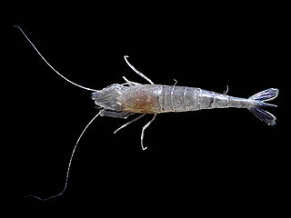
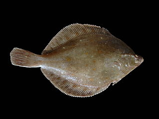
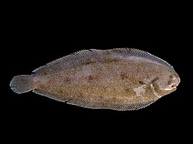

# ODD Protocol: German North Sea Small-scale Fisheries

The Agent-based Model (ABM) of the German North Sea Small-scale Fisheries is a Social-Ecological Systems (SES) model focussing on the adaptive behaviour of fishers facing regulatory, economic, and resource changes.  The model description follows the ODD (Overview, Design concepts, Details) protocol for describing individual- and agent-based models (@Grimm2010, @Grimm2020).  By following this  protocol, we aim to document the ABM such that it is replicable independently of the current implementation (in NetLogo, @Wilensky1999). 
 
## Purpose

Small-scale fisheries are an important part both of the cultural perception of the German North Sea coast and of its fishing industry. These fisheries are typically family-run operations that use smaller boats and traditional fishing methods to catch a variety of bottom-dwelling species, including plaice, sole, brown shrimp.

Fisheries in the North Sea face area competition with other uses of the sea -- long practiced ones like shipping, gas exploration and sand extractions, and currently increasing ones like marine protection and offshore wind farming (OWF).  German authorities have just released a new maritime spatial plan implementing the need for 30% of protection areas demanded by XXX and allowing up to 70 GW of offshore wind power generation.  

Fisheries in the North Sea also have to adjust to the northward migration of their established resources following the climate heating of the water.  And they have to re-evaluate their economic balance by figuring in the foreseeable rise in oil price and the need for re-investing into their aged fleet.

The **purpose** of this ABM is to provide an interactive simulation environment that describes spatial, temporal and structural adaptations of the fleet.  It adaptively describes
 
 * where to fish  and how far to go out to sea
 * how often to go out
 * what gear to use and what species to target

Its **scope** is the German North sea small-scale fisheries.  This encompasses some 300 vessels based in German ports along the North Sea coast and fishing in the German Bight, including but not restricted to Germany's exclusive economic zone (EEZ). The target species is currently restricted to the most important ones: plaice, sole and brown shrimp, but is in principle extensible to further target species like Norwegian lobster or whiting. 

The **intended audience** of the ABM are marine researchers and government agencies concerned with spatial planning, environmental status assessment, and climate change mitigation.  It can also assist in a stakeholder dialogue with tourism and fishers to contextualize the complexity of the interactions between fisheries economics, changing resources and regulatory restrictions.  It is intended to be used for scenario development for future sustainable fisheries at the German North Sea coast.

## Entities, state variables, and scales	

The primary agents in the ABM are the fishing vessels, denoted as *boats*.  They are linked to supplementary classes of agents that describe the *gears* used for fishing, the target species denoted as *preys* and the *ports* that are home to the boats. The agents interact with the *environment* that describes the *spatial domain* and resource and regulatory changes.

### The primary agent: boats

Boats are located at ports, according to the distribution of the German fleet in those ports.  In the German fleet there are four distinct clusters of small-scale fisheries vessels  that have typical vessel and crew size,  gear and fishing strategy (@Oerey2023).  With those come physical  (speed, length, capacity, engine power) and economic properties (fixed and variable costs).  Boats have a catch efficiency that tries to model the experience of the individual boat owners.

<!-- @todo  we need to work on catch-efficiency, maybe leave it out? -->

Boats go on fishing trips and record the catch and the revenue. They internally record the economic balance of their activites and continuously adapt preferences, e.g., for choosing a specific gear. 

<!-- @todo  we need to work on addinng area-flexbilty, max distance and other variables to memory -->

### Subsidiary agents: ports, preys, gears

Ports, preys, and gears are inactive agents that are introduced to structure the model in object-oriented design and encapsulated their state variables and methods.

Ports can be boats' home or favourite landing **ports**. Boats start their activity from a port and dock to unload at a port.  They can stay in a port when deciding not to fish.  Along the German coast, there are 54 ports, for which boat and landing statistics are available.   At the ports, the simulated landings are recorded.

<!-- @todo  Make landings a prognostic variable for ports, get rid of landing statistics for now as input -->

The fishery target species are denoted **preys**.  Currently, the ABM describes three different species:

| **Prey instance** | **Description** | **Picture** |
| --- | --- | --- |
| Crangon | The brown shrimp *Crangon crangon* ... |  { width=25% }|
| Pleuronectes | The plaice *Pleuronectes platessa* ... |  { width=25% }|
| Solea | The sole *Solea solea* ... | { width=25% } |

<!-- @todo  Add fish descriptions -->

The model is designed to accomodate further species relevant to the small-scale fishery such as whiting (*Merlangius merlangus*), sprat (*Sprattus sprattus*), or Norwegian lobster (*Nephrops norvegicus*).

Boats and preys are connecte via the **gears** agent.  The gear prescribes the geometric area that can be fished, the speed at which fishing can occur, and the prey that is caught.  A gear can be installed, or changed, on a boat, subject to economic (invvestment cost) and physical (weight, size) constraints.  The gear also determines the impact of the fishing activity on the environment, i.e. how much prey is removed and how much of the sea floor is swept.

<!-- @todo  Add the change of gear -->
<!-- @todo  Add SAR diagnostic -->
<!-- @todo  Add removal and recovery of prey -->

### Spatial units

The spatial domain is described by a grid, whose cells (in NetLogo: patches) carry spatial information on the environment and record activity information.  The domain itself is the German Bight including Germany's EEZ.  It is represented geographically in the WGS84 datum, and bounded by the rectangle spanned by the coordinates (2° E; 53°N) and (10° E; 56 °N); the resolution is 0.025 x 0.025 degree (1.5 arc minutes, or approximately 1.7 x 2.9 km).  The resulting grid has a size of 320 columns x 120 rows.

The domain is divided into an active part (water) and an inactive part (land).  The demarcation between land and water is achieved by using the GEBCO bathymetry bounded by European Environmental Agency's coastline dataset.  Using a creep-fill algorithm a continuous accessible domain is ensured.

Cells carry information on resources (fish stocks of the respective species, at climatological seasonal resolution), regulatory fishery closure areas (offshore wind and trawling exclusion zones).  They record activity of the fishery occuring in the grid cell as area swept and as hours fished.

<!-- @todo add SAR -->

### Nonspatial environment

A calendar records time.  The temporal domain are multiple years and the temporal resolution is 1 day.  With the progress of the calendar, surrogate weather is introduced that may influence a boat's decision to go on a fishing trip.  Seasonal information is used to describe the annual variation of prey resources.  

<!-- @todo Use the weather -->

## Process overview and scheduling

The global timestep of the model is one day.  Within the 24-hour period, we use Discrete Event Simulation (DES) to trigger the action of boats within 5 phases  

| **Phase* | **Location** |**Description** |
| --- | --- | --- |
| Phase 0 rest  | port | Boats are resting, not ready to go out |
| Phase 1 ready | port-sea |  Boats are ready to go out and are deployed|
| Phase 2 steam | sea  | Boats steam in open water |
| Phase 3 fish  | sea  | Boats fish open water  |
| Phase 4 steam | sea  | Boats need to return  |
| Phase 5 land  | port | Boats are offloading |

Boats cycle through all phases consecutively, keeping a record of how much time they spend.  Boats in **phase 0** keep the legal resting time of 11 hours, and rest during the weekend (from Saturday noon to Monday 4 am).  After the resting period, they make a decision on whether to go out or not.  This decision may depend on weather and  (in a later model version) expected catch.  If the decision is positive, a boat enters phase 1.  Boats in **phase 1** virtually steam from the port location to the port's closest open sea deployment location.  Adding this phase makes it possible for the ports to be located on dry ground at the available grid resolution, as many ports are located upstream of the coastline demarcation.  Having arrived at the deployment locatino, boats enter phase 2.

Boats in **phase 2** steam to a preferred location for the next fishing haul.  This preferred location is chosen randomly but subject to the fuel constraints and maximum distance preference of each boat.  At a later implementation of the model, this location is also chosen taking into account previous experience of successful fishing hauls.  Phase 2 may also be entered after an unsuccessful fishing haul.  At the new location, a boat enters **phase 3** for fishing.  Fishing is done in several hauls;   a haul is directed towards only accessible water, and at the end of a haul the ship turns around (with slight variation) continues to the next haul.

To record the fishing activity on the cells, a haul is subdivided into time steps of 6 minutes duration.  The time spend in a cell and the area swept is recorded for the gear with the highest priority. The catch is calculated separately for each gear (and the gear-associated target species), taking into account the target species biomass, the gear width and haul distance and the boat's catch efficiency.
Hauls continue until one of the following constraints is met (always taking into account the time and fuel cost of the return trip):

1. The maximum preferred time at sea is exhausted;
2. the maximum time from the first successful catch (24 hours to keep fresh) is exhausted;
3. the fuel is exhausted;
4. the loading capacity is exhausted;
5. the catch is considered insufficient.  

On an insufficient catch, the boat enters phase 2 to look for a different location.  On a successful catch and after having spent the allocated time or fuel, the boat enters phase 4.

Boats in **phase 4** need to return.  They virtually steam in a straight line to their deployment location and on to their port. At the port, they enter **phase 5** to unload their catch and clean the boat.  Priorities for the different gears are updated based on the relative change of the deployed gears and catches.
Finally, boats re-enter phase 0 and start the cycle. 

## Design concepts

### Basic principles

The ABM is an adaptive model with the **objective** of maximizing profits, subject to environmental, economic, and individual constraints. The **adaptation** is currently restricted to the priority change in gear with the shifting priorities VIABLE approach [@Bendor2019],[@Scheffran2016].  

In the VIABLE approach, each boat carries a list of priorities that are subject to change based on the boats perception of its activities.  During each haul, the benefits (i.e. the price of the catch times the amount caught) are contrasted with the costs of that haul (wage and fuel) in parallel for all gears available to a boat. The value (gain or loss, in €) for each gear type is multiplied by an adaptation rate which is added to the priorities.  

More general, there arestrategies $i \in 1..n$ with priorities $r_i$, values $V_i$ and adaptation rates $a_i$. The marginal benefit of a change in $V$ with respect to $r$ is $v_i=\partial{V_i}/\partial{r_i}$.  

The temporal change of the priorities $r_i$ is given by 
$$
\frac{dr_i}{dt} = a_i r_i \cdot \frac{v_i - \sum r_i v_i }{\sum v_i}
$$

### Emergence

The emergent property is the spatial pattern of fishing activities, which is best recorded as maps of effort or maps of swept area ratio (SAR). This property can be compared to existing data on effort or SAR, and it gives information on the location of the largest potential environmental impact of fisheries. 

### Learning

To enable learning, boats implement a memory of best hauls, recording the amount caught and the cell location, This memory has size 20. After a training phase, boats may choose to steam preferentially to one of the best 10 past experienced locations to start fishing.  

### Prediction

When deliberating to change to a gear with higher priority, boats have to discount the installation cost of a new gear and compare this with future expected gains.  They can only switch gears if the predicted future gain with the new gear minus the installation cost is higher than the predicted future gain of the current gear. 

### Sensing and Interaction

Boats sense the resource availability of each cell, as well as global fuel prices and port-dependent market prices. There is no **interaction** between boats.   A feedback of the boats onto the cells by depleting their prey resource is foreseen but currently not implemented.

### Stochasticity
Boats are distributed across harbors according to empirical data.  Their assignation to one of the four clusters is stochastic within the empirical distribution.  Physical data of the boats are stochastic within the empirical limits of their cluster.  

The direction of a haul is random across all accessible directions. The weather is stochastic within the limits of a typical North sea storm climatology. 

## Initialization

Ports and boats are intialized from empirical statistics available for the year 2015.  The resources are initialized from a species distribution model (SDM) based on stock assessments and environmental data for the period 2015-2020. Time is initialized on 1 Jan 2020.  

## Input data

The model makes use of extensive external data sources to describe the environment and to initialize the agents.
All data are publicly available and licensed for use.  The data sources are

| **Description* | **Source** | 
| --- | --- | --- |
| Port landings data 2015 | Hochschule Bremerhaven, unlicensed |
| Species distribution of plaice, sole, and brown shrimp | Thünen Institute, PDDL-1.0 |
| Species information | FAO |
| Bathymetry | GEBCO |
| Offshore Wind farms | EMODNet |
| EEZ | United Nations |
| ICES subregional divisions | ICES |
| Plaice box | European Commision |
| Geodetic information | International Earth Rotation Service |
| National Parks | NLWKN, DL-DE-BY-2.0 |

# CRediT authorship contribution statement
C.Lemmen: Conceptualization, Methodology, Resources, Software, Formal analysis, Data curation, Project administration, Writing – original draft, Writing – review & editing.
S.Hokamp: Conceptualization, Software, Methodology, Formal analysis, Writing – review & editing.
S.Örey: Conceptualization, Data curation, Writing – review & editing.
J. Scheffran: Conceptualization, Formal analysis, Writing – review & editing
J.Seung: Writing – original draft.

<!--
## Sub-models
1. **Sub-models**
-->

# References 
